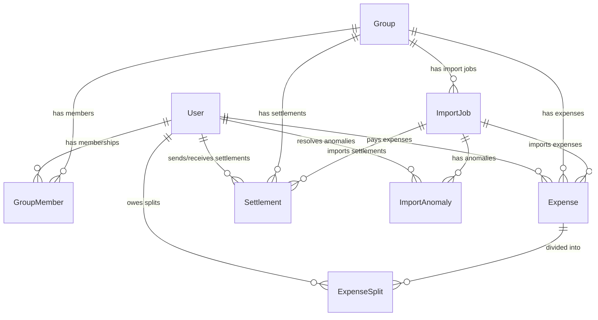

# SCOPE.md - Anomaly Log and Database Schema

This document outlines the anomalies detected in `expenses_export.csv`, our policies for resolving them, and details of the database schema.

---

## 1. CSV Data Anomaly Log & Resolution Policies

We identified 12+ structural and semantic data issues in the exported CSV file. Here is how our app's import module handles each:

| Row index | Description in CSV | Detected Problem | Resolution Policy & Rationale |
|---|---|---|---|
| **5 & 6** | `Dinner at Marina Bites` / `dinner - marina bites` (Dev, 3200) | Duplicate transaction entry. Same date, same amount, same payer. | **Policy: Flag & Resolve.** The importer flags these as potential duplicates. The user (e.g. Meera) is presented with both and can choose to Keep One (Line 5), Keep Both, or Merge. By default, it marks the second one as a warning and proposes skipping. |
| **7** | `Electricity Feb` | Amount has double quotes and comma: `"1,200"` | **Policy: Clean and Parse.** The importer strips quotes and commas, parsing the value as a numeric float `1200.00` to prevent database schema violations. |
| **9** | `Movie night snacks` | Lowercase payer name `priya` | **Policy: Match case-insensitively.** Names are cleaned (trimmed and converted to title case) and matched against the active user database to associate the expense with `Priya`. |
| **10** | `Cylinder refill` | Amount has three decimal places: `899.995` | **Policy: Round to standard decimal.** Rounded to two decimal places: `900.00` (default bank rounding) or stored exactly using `Decimal(12, 4)` and rounded on display/ledger splits to avoid fractional paisa issues. |
| **11** | `Groceries DMart` | Paid by `Priya S` (unknown user) | **Policy: Validation Error & Map.** The importer flags this as an `ERROR` because `Priya S` is not in the group. The user must manually resolve this in the import review UI by mapping `Priya S` to the registered `Priya` user. |
| **12** | `Aisha birthday cake` | Split type is `unequal` (shares given as Rohan 700; Priya 400; Meera 400) | **Policy: Parse split details.** The importer extracts names and exact amounts from `split_details`. It verifies that the sum of detail amounts (700 + 400 + 400 = 1500) matches the total expense amount. If valid, it imports as an `EXACT` split. |
| **13** | `House cleaning supplies` | Payer column is blank (`paid_by` empty) | **Policy: Blocking Validation Error.** Since an expense must have a payer, the import job is put in `PENDING_REVIEW` status and cannot be fully saved until the user selects who paid this in the review UI. |
| **14** | `Rohan paid Aisha back` | A debt settlement logged as an expense | **Policy: Import as Settlement.** The notes explicitly say "this is a settlement not an expense". The importer parses this row, detects it is a settlement, and creates a `Settlement` record (`Rohan` paid `Aisha` 5000) instead of an `Expense`. |
| **15** | `Pizza Friday` | Percentage split details sum to 110% (`30% + 30% + 30% + 20%`) | **Policy: Validation Error & Re-normalize.** The system flags this as an error. In the review UI, the user is offered to normalize the values to sum to 100% (by dividing each ratio by 1.1, giving 27.27%, 27.27%, 27.27%, 18.18%) or correct them manually. |
| **20, 21, 23, 26** | USD Goa trip expenses | Amount is in USD (trip transactions in dollars) | **Policy: Normalize to base currency (INR).** The app converts USD to INR using a standard historical rate (1 USD = 83 INR). Both the original currency/amount and the converted INR amount are stored on the `Expense` model for transparency (Priya's request). |
| **23** | `Parasailing` | Splits with unregistered user `Dev's friend Kabir` | **Policy: Guest User Assignment.** The importer flags `Dev's friend Kabir`. In the review UI, the user can choose to: (a) Add Kabir as a guest user, (b) Split Kabir's share among active flatmates, or (c) Re-allocate Kabir's share to Dev (who paid/brought him). |
| **24 & 25** | `Dinner at Thalassa` by Aisha (2400) vs `Thalassa dinner` by Rohan (2450) | Conflicting transaction logs (Aisha vs Rohan logging the same dinner with different amounts). | **Policy: Conflict Warning.** Flagged as a duplicate conflict. The UI prompts the user to select the correct log. As per the notes, Aisha's might be wrong, so the system suggests keeping Rohan's 2450. |
| **26** | `Parasailing refund` | Negative amount: `-30` USD | **Policy: Import as negative expense/refund.** A negative expense reduces the total group spend and credit/debit balances in the correct split proportion. |
| **27** | `Airport cab` | Date is in `Mar-14` format instead of `DD-MM-YYYY` | **Policy: Smart Date Parser.** The date string is parsed via a flexible date parser (e.g. `moment` or `date-fns`) and normalized to `2026-03-14`. Payer `rohan ` is trimmed and capitalized to match `Rohan`. |
| **28** | `Groceries DMart` | Currency column is blank | **Policy: Default to Base Currency.** Default currency is set to `INR`. |
| **31** | `Dinner order Swiggy` | Expense amount is `0` | **Policy: Warning / Auto-Skip.** The expense has zero value. The system flags it and recommends skipping the import of this row. |
| **36** | `Groceries BigBasket` | Includes `Meera` after she moved out (`02-04-2026`) | **Policy: Out of membership boundary warning.** The system checks the date of the expense against the members' active timeline. Since Meera moved out at the end of March, the system excludes Meera from this April split and divides the balance among Aisha, Rohan, and Priya. |
| **38** | `Sam deposit share` | Sam paid Aisha deposit (15000 INR) | **Policy: Import as Settlement.** This is an individual payment from Sam to Aisha, not a shared group expense. The app creates a `Settlement` record for 15,000 INR from Sam to Aisha. |
| **40** | `Electricity Apr` | Date `12-04-2026` includes `Sam` (who moved in mid-April, ~April 15) | **Policy: Dynamic Membership Check.** The system compares the date of the expense with Sam's joining date. Since it occurred before Sam moved in, Sam is excluded from the split by default, and the expense is split among Aisha, Rohan, and Priya. |
| **42** | `Furniture for common room` | Split type says `equal` but shares are provided | **Policy: Parse split details anyway.** Even though split type is `equal`, the split details specify shares. The system parses the split details as `SHARE` split type to verify correct allocations. |

---

## 2. Database Schema Representation

### Table Definitions

1. **User**: Represents flatmates (Aisha, Rohan, Priya, Meera, Sam, Dev, and guest Kabir). Stores name, email (for login), and password hashes.
2. **Group**: Groups of flatmates (e.g., "Flat Shared Expenses" or "Goa Trip").
3. **GroupMember**: Tracks membership timeline of users in groups with `joinedAt` and `leftAt` timestamps to ensure correct retroactive calculations.
4. **Expense**: Shared expenses. Stores description, date, original amount/currency, exchange rate, and normalized `amountInInr` for computations.
5. **ExpenseSplit**: Specifies the portion owed by each member for a given expense, storing the raw share value and the calculated `amountInInr`.
6. **Settlement**: Tracks direct payments between users (e.g., Rohan paying Aisha back, or Sam paying deposit) that reduce net debts.
7. **ImportJob**: Logs file uploads and their review status (`PENDING_REVIEW`, `COMPLETED`, `FAILED`).
8. **ImportAnomaly**: Records all issues flagged by the CSV parser, saving row index, raw row data as JSON, anomaly category, severity, and the resolution action selected.
